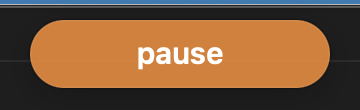

Version 2 of Speaking Speed stops showing your words per minute. The menu bar now shows a dot that only changes when there's something to do: after 15 seconds of talking without a pause, it turns orange and a small "pause" pill appears near the camera; if your pace stays above about 200 words per minute (adjustable from the menu) for a while, it turns red with "slow down". Mark a call with Start call and End call in the menu and at the end you get a one-line summary and one question: how did that feel? Calm, OK or rushed. Why we hid the number: [lessons from version 1](../docs/v1-lessons.md).

