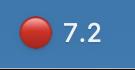

First working version: a native Mac menu-bar indicator that listens to the mic and shows your speaking rate and a calm/brisk/fast zone, with a one-time calibration to your normal pace and a summary of each session. It runs locally in about 16 MB of memory; nothing public to link to yet, and the rate estimate still needs tuning against real calls.

